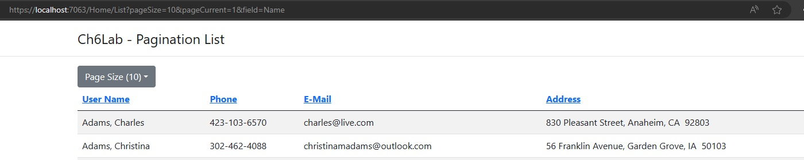
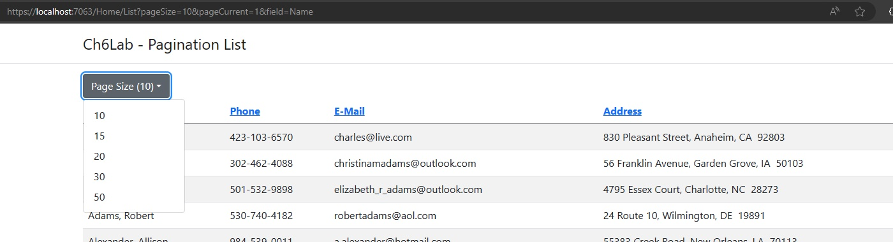
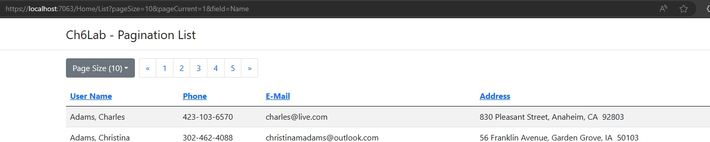

# Build the Pagination User List
For this project, you will follow instructions below to create the pagination list the customer needs.

- This program is working and will do the pagination by Query String
    - Run Project
    - Click [User List] Button to open the User List Page.
    - Look at the URL, `https://localhost:7063/Home/List?pageSize=10&pageCurrent=1&field=Name`
    - You can change the values on the url by hand to see what happens...
        - change pageSize to 30.
        - change field to EMail

1. Add Route to Simplify the URL
    - The project has the Controller Routes setup already
    - Add `Route` Attribute so we can...
        - Not use Home each time, Just want to use List `~/List/`
        - Next, would be the Field.  ex: `~/List/Phone/`
        - Next, would be the Page Size.  ex: `~/List/Address/30/`
        - Last, would be the Current Page.  ex:`~/List/EMail/20/4`
    - We want the Default values of... 
        - Page Size = 10 
        - Current Page = 1

1. Create the `ListInfo` class as a View Model.
    - Create ListInfo in Models (keep it simple)
    - The ListInfo needs these Properties...
        - `List<User> Users`
        - `UserField Field`
        - `int CurrentPage`
        - `int PageSize`
        - `int TotalPages => (int)Math.Ceiling((decimal)Data.Users.Count / pageSize)`
    - The TotalPages will calculate and is Read Only
    - Populate a new ListInfo in Controller
    - And Pass that object into the `View(listInfo)`
    - Change the List Razor Page to use ListInfo as the model
    - the foreach loop will need to be fixed to use the new Model.
    - Test this by changing the href in Index.cshtml to use the new Route.
        - `href="~/List/Name"`

1. Change the headers on the table to sort the list by that field.
    - Wrap the text in the `<th>` in a Link (`<a href="">Name</a>`)
    - We need to change the href to reload the User List page with the field set to the column and reset current page to 1.
        - `href="~/List/?/@Model.PageSize/1"`
        - the href above, replace the ? with field value (Must Match the `UserField` enumeration)
        - the @Model.PageSize will inject the value into the URL.
    - Run and test this.

1. Add a Dropdown Button to set the page size.
    - [Dropdown Button is from Bootstrap](https://getbootstrap.com/docs/5.3/components/dropdowns/)
        - `<button class="btn btn-secondary dropdown-toggle" type="button" id="buttonPageSize" data-bs-toggle="dropdown"
            aria-haspopup="true" aria-expanded="false">Page Size (@Model.PageSize)</button>`
    - Place the button above the table like in the figures below.
    - 
    - 
    - The button text has the page size value shown in the parentheses.
    - The options in the list are 10, 15, 20, 30, 50 but will reset the current page to 1.
    - Each Entry in the Dropdown is a Link Tag
        - `href="~/List/@Model.Field/?/1"`
        - replace the ? with the page size
        - the @Model.Field will inject the current field.

1. Last, need to add a Pagination component.
    - [Pagination is from Bootstrap](https://getbootstrap.com/docs/5.3/components/pagination/)
```html
<ul class="pagination ms-2">
    <li class="page-item"><a class="page-link" href="#">&laquo;</a></li>
    <li class="page-item"><a class="page-link" href="#">1</a></li>
    <li class="page-item"><a class="page-link" href="#">2</a></li>
    <li class="page-item"><a class="page-link" href="#">3</a></li>
    <li class="page-item"><a class="page-link" href="#">4</a></li>
    <li class="page-item"><a class="page-link" href="#">5</a></li>
    <li class="page-item"><a class="page-link" href="#">&raquo;</a></li>
</ul>
```
-   - We want it next to the Dropdown button
    - 
    - again, each page is a Link tag that we need to edit the href...
    - there is some math and calclation to help.
    - in the code block lets create a variable to store the start page number.
```csharp
@{
    ViewBag.Title = "List Users";

    int startPage = Model.CurrentPage - 2;
    if (startPage < 1)
    {
        startPage = 1;
    }
    else if (startPage > Model.TotalPages - 5)
    {
        startPage = Model.TotalPages - 5;
    }
}
```
-   - this limits the start so its never negative or over the total pages.
    - now we can do the Numbered pagination links.
    - `href="~/List/@Model.Field/@Model.PageSize/@(startPage + ?)"`
    - replace the ? with 0 to 4.
    - and replace the text with the `@(startPage + ?)` same as value above.
    - next, we need to change the previous page and the next page 
    - we want the current page to change + 1 for next and - 1 for previous
        - need a check so it will not be Out of Bounds.
        - check if Model.CurrentPage == 1 for previous and
        - and if Model.CurrentPage == Model.TotalPages for next.
